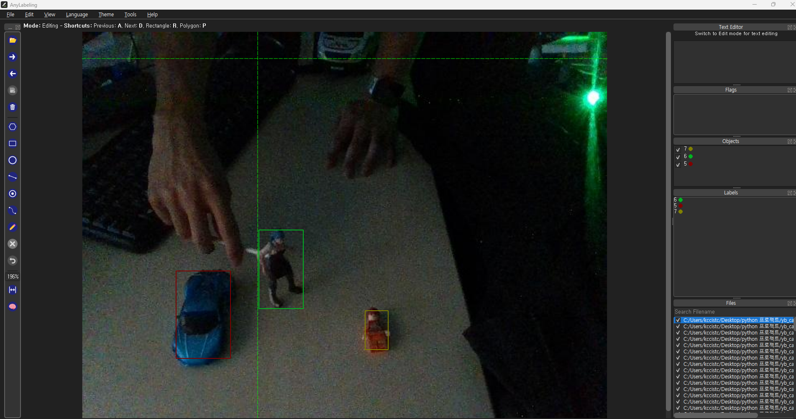
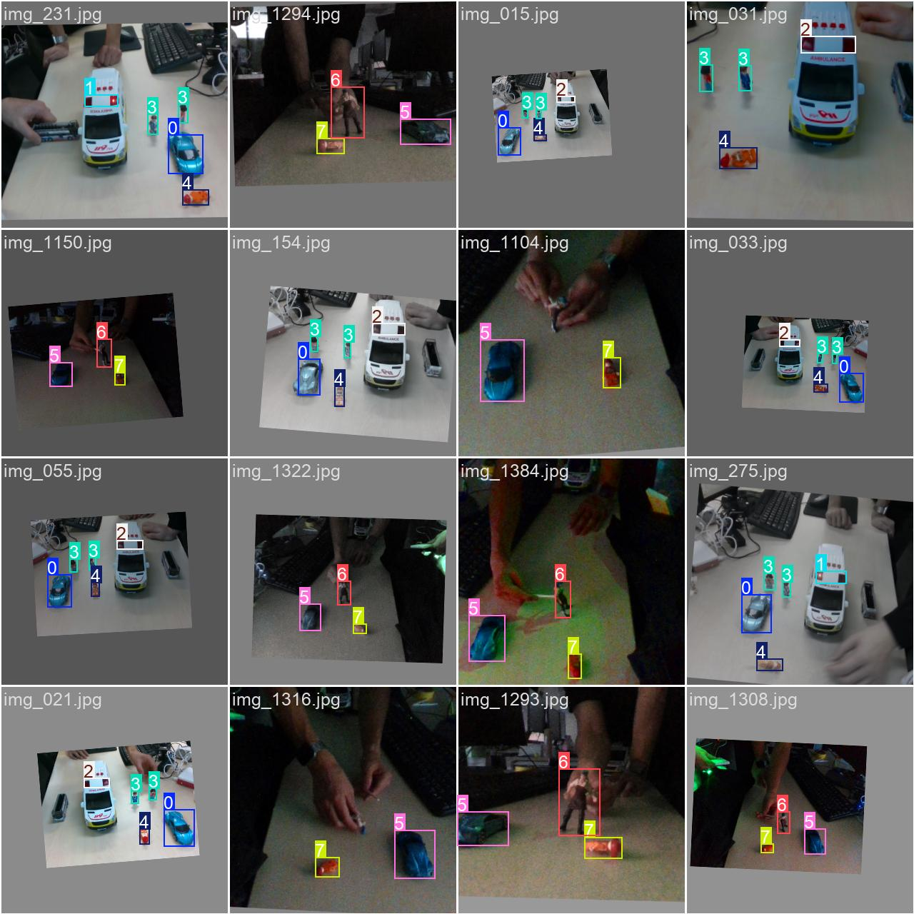
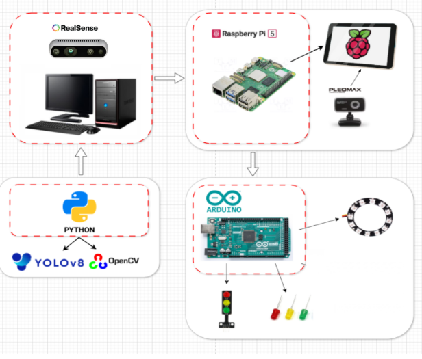

# 🚦 AI 기반 스마트 교통 관리 시스템 ( Smart Traffic Management System)

Raspberry Pi 5 환경에서 YOLO 객체 탐지 모델과 OpenCV 영상처리를 활용하여  
교통 상황을 실시간으로 분석하고, 위험 상황 또는 교통 위반 이벤트를 자동으로 감지하는 시스템입니다.

본 프로젝트는 횡단보도, 차도, 불법 주정차 구역, 유턴 구역 등의 관심 영역(ROI)을 기준으로  
보행자와 차량의 위치 및 움직임을 판단하며, 이벤트 발생 시 이미지 저장, 로그 기록, 통계 관리까지 수행하도록 구현했습니다.

---

## 📌 프로젝트 개요

### 프로젝트 기간
2026.03.06 ~ 2026.03.21

### 프로젝트 목표

- 실시간 영상 기반 교통 위반 및 위험 상황 감지
- YOLO 모델을 활용한 사람, 차량, 긴급 차량, 낙상 객체 인식
- OpenCV 기반 ROI 분석을 통한 상황별 이벤트 판단
- 이벤트 발생 시 이미지 저장 및 SQLite 데이터베이스 기록
- Raspberry Pi와 Arduino를 연동한 외부 알림 장치 제어
- 실제 도로 상황과 모형 환경 모두에서 동작 가능한 시스템 구현

---

## 🛠 사용 기술 및 장비

| 구분 | 사용 기술 / 장비 | 설명 |
|---|---|---|
| Programming | Python | 전체 시스템 제어 및 이벤트 판단 로직 구현 |
| AI Model | YOLOv8 | 사람, 차량, 긴급 차량, 낙상 등 객체 탐지 |
| Image Processing | OpenCV | ROI 설정, 영상 처리, 객체 위치 분석, 이미지 저장 |
| Edge Device | Raspberry Pi 5 | 실시간 영상 분석 및 시스템 실행 |
| Camera | Intel RealSense D435i | 메인 영상 입력 및 거리 정보 활용 |
| Camera | PILOMAX USB Webcam | 보조 카메라를 이용한 사각지대 및 이벤트 화면 캡처 |
| Database | SQLite | 이벤트 로그, 이미지 경로, 발생 시간, 통계 데이터 저장 |
| Display | XPT2046 Touch Controller | Raspberry Pi 기반 UI 화면 출력 |
| External Control | Arduino MEGA 2560 R3 | LED, NeoPixel 등 외부 알림 장치 제어 |
| Communication | Serial Communication | Raspberry Pi와 Arduino 간 상태 명령 전송 |
| Labeling Tool | AnyLabeling | 직접 촬영한 모형 데이터 라벨링 |
| Dataset Platform | Roboflow | 초기 객체 인식 모델 학습용 데이터 활용 |

---

## 🧠 시스템 동작 흐름
<p align="center">
  <br>
  <b>스마트 도로교통 시스템 동작 흐름도</b>
</p>

1. 카메라를 통해 실시간 영상 입력
2. YOLO 모델을 이용해 사람, 차량, 긴급 차량, 낙상 객체 탐지
3. OpenCV로 설정한 ROI 영역과 객체 바운딩 박스의 겹침 정도 분석
4. 신호 상태, 객체 위치, 이동 방향, 유지 시간 등을 종합하여 이벤트 판단
5. 이벤트 발생 시 이미지 저장 및 SQLite DB에 로그 기록
6. 필요 시 Arduino로 명령을 전송하여 LED 또는 NeoPixel 알림 제어
7. 디스플레이 화면에 현재 상태 및 이벤트 결과 출력

---

## 📋 주요 기능

### 1. 횡단보도 무단횡단 감지

보행자 신호가 빨간불인 상황에서 사람이 횡단보도 ROI에 일정 비율 이상 진입하면  
무단횡단 이벤트로 판단합니다.

- 사람 객체와 횡단보도 ROI의 겹침 비율 계산
- 보행자 신호 상태와 함께 조건 판단
- 이벤트 발생 시 이미지 저장
- SQLite DB에 시간, 이벤트 종류, 이미지 경로 기록
- 동일 객체 반복 감지를 줄이기 위한 쿨타임 적용
- 야간 상황에서는 NeoPixel 빨간색 LED 점등

---

### 2. 차도 무단횡단 감지

사람이 횡단보도가 아닌 차도 ROI로 진입하는 경우,  
신호 상태와 관계없이 위험한 무단횡단 상황으로 판단합니다.

- 도로 ROI와 사람 객체의 겹침 여부 확인
- 횡단보도 외 구역 침범 시 이벤트 처리
- 보조 USB 웹캠을 이용한 무단횡단자 화면 캡처
- 이벤트 이미지 및 로그 저장
- 야간 상황에서 NeoPixel 빨간색 LED 출력

---

### 3. 차량 횡단보도 침범 감지

차량 신호가 빨간불인 상황에서 차량이 횡단보도 영역에 진입하면  
차량 횡단보도 침범 이벤트로 판단합니다.

- 차량 객체와 횡단보도 ROI의 겹침 비율 계산
- 차량 신호 상태 기반 조건 판단
- 야간에는 NeoPixel 파란색 LED 점등
- 이벤트 발생 시 화면 및 로그 기록

---

### 4. 불법 주정차 감지

차량이 불법 주정차 구역 ROI 안에 일정 시간 이상 머무르면  
불법 주정차 이벤트로 처리합니다.

- 차량 객체가 지정 구역 안에 머문 시간 측정
- 일정 시간 이상 유지 시 이벤트 발생
- 차량 이미지 저장
- DB에 발생 시간 및 이미지 경로 기록

---

### 5. 불법 유턴 감지

차량이 특정 도로 ROI를 순차적으로 침범하거나 양쪽 차선 영역에 걸쳐 이동하는 경우  
불법 유턴 상황으로 판단합니다.

- 차량의 위치 변화 및 ROI 진입 여부 분석
- 양쪽 도로 구역의 침범 비율 확인
- 불법 유턴 차량 이미지 저장
- 이벤트 로그 기록

---

### 6. 낙상 사고 감지

YOLO 모델에서 낙상 객체가 감지되면 일반 교통 위반 이벤트와 구분하여  
비상 상황으로 처리합니다.

- fall 클래스 감지 시 긴급 이벤트 발생
- 디스플레이에 비상 상황 출력
- 일반 이벤트보다 우선순위가 높은 상태로 처리

---

### 7. 긴급 차량 감지

긴급 차량 또는 경광등 ON 상태가 감지되면  
교통 흐름을 제어하기 위한 비상 상태로 전환합니다.

- 긴급 차량 클래스 감지
- 일정 시간 동안 비상 상태 유지
- 차량 신호등의 빨간불, 노란불, 초록불을 모두 점등
- 디스플레이에 긴급 상황 알림 출력

---

### 8. 이벤트 저장 및 통계 관리

모든 이벤트는 추후 확인이 가능하도록 SQLite 데이터베이스에 저장됩니다.

저장 정보는 다음과 같습니다.

- 이벤트 발생 시간
- 이벤트 종류
- 저장된 이미지 경로
- 날짜별 이벤트 누적 횟수
- 통계 확인용 데이터

---

## ⚙️ 데이터 학습 및 전처리

### 1. 공공 데이터 기반 초기 학습

<p align="center">
  <br>
  <b>공공 데이터 기반 초기 모델 테스트 결과</b>
</p>

초기 모델 학습에는 Roboflow에서 제공하는 사람 및 차량 관련 데이터를 활용했습니다.  
이를 통해 기본적인 객체 인식 성능을 확보한 뒤, 실제 프로젝트 환경에 맞게 추가 학습을 진행했습니다.

### 2. 모형 환경 데이터 직접 수집

<p align="center">
  <br>
  <b>모형 환경 데이터 라벨링 과정</b>
</p>

<p align="center">
  <br>
  <b>모형 데이터 라벨링 결과</b>
</p>

실제 시연 환경에서는 작은 모형 차량과 보행자 객체를 사용했기 때문에  
기존 데이터만으로는 인식률이 충분하지 않았습니다.

이를 해결하기 위해 직접 모형 환경을 촬영하고,  
AnyLabeling 도구를 사용하여 객체를 라벨링한 후 추가 학습을 진행했습니다.

### 3. 모델 최적화

Raspberry Pi 5에서 실시간으로 동작해야 했기 때문에  
성능과 속도의 균형을 고려하여 모델을 조정했습니다.

- 초기 모델 테스트
- 모형 데이터 추가 학습
- YOLOv8 기반 재학습
- Raspberry Pi 실행 속도를 고려한 ONNX 모델 사용
- 카메라 2대 동시 사용 시 프레임 처리 최적화

---

## 📷 시스템 구성

<p align="center">
  <br>
  <b>스마트 도로교통 시스템 구성</b>
</p>

### 하드웨어 구성

- Raspberry Pi 5
- Intel RealSense Depth Camera D435i
- PILOMAX USB Webcam
- Arduino MEGA 2560 R3
- XPT2046 Touch Controller
- NeoPixel LED
- 신호등 모형
- 도로 및 횡단보도 모형

### 소프트웨어 구성

- Python 기반 메인 제어 프로그램
- YOLOv8 객체 탐지 모델
- OpenCV 영상 처리
- SQLite 데이터베이스
- Arduino LED 제어 코드
- Serial 통신 기반 장치 제어

---

## 🖥️ 실행 화면 및 시연 내용

### 횡단보도 무단횡단 감지

- 차량 신호등이 빨간불인 상황에서 사람 객체가 횡단보도 ROI에 진입
- ROI 겹침 비율이 기준값 이상이면 무단횡단으로 판단
- 보조 웹캠 화면으로 무단횡단자 영역 출력
- 이벤트 이미지와 시간 정보 DB 저장
- 야간 상황에서는 NeoPixel 빨간색 LED 점등

### 차도 무단횡단 감지

- 사람이 횡단보도가 아닌 차도 영역으로 이동
- 신호 상태와 관계없이 도로 ROI 침범 시 이벤트 발생
- 이벤트 이미지 저장 및 로그 기록
- 야간에는 빨간색 LED로 위험 상황 표시

### 불법 주정차 감지

- 차량이 불법 주정차 구역에 일정 시간 이상 머무름
- 정차 유지 시간이 기준을 넘으면 이벤트 발생
- 차량 이미지 저장
- DB에 발생 시간과 이미지 경로 기록

### 불법 유턴 감지

- 차량이 유턴 금지 구역 또는 양방향 도로 ROI를 침범
- 차량 위치 변화와 ROI 조건을 바탕으로 불법 유턴 판단
- 이벤트 이미지 및 로그 저장

### 차량 횡단보도 침범 감지

- 차량 신호가 빨간불일 때 차량이 횡단보도 ROI에 진입
- 횡단보도 침범 이벤트 발생
- 야간 상황에서는 NeoPixel 파란색 LED 점등

### 낙상 사고 감지

- fall 클래스 감지 시 비상 이벤트 발생
- 일반 교통 위반 이벤트와 분리하여 처리
- 디스플레이에 비상 상황 출력

### 긴급 차량 감지

- 긴급 차량 또는 경광등 ON 상태 감지
- 차량 신호등 3색을 모두 점등하여 비상 상황 표시
- 디스플레이에 긴급 상황 메시지 출력

---

## 💾 데이터베이스 관리

이벤트 발생 시 SQLite DB에 다음 정보를 저장합니다.

| 항목 | 설명 |
|---|---|
| id | 이벤트 고유 번호 |
| event_type | 발생한 이벤트 종류 |
| timestamp | 이벤트 발생 시간 |
| image_path | 저장된 이미지 경로 |
| date | 일별 통계 관리를 위한 날짜 정보 |

데이터베이스를 사용하여 단순히 이벤트를 감지하는 것에서 끝나지 않고,  
발생 이력을 누적하여 추후 분석할 수 있도록 구성했습니다.

---

## ⚠️ Trouble Shooting

### 1. 신호등을 사람으로 잘못 인식하는 문제

#### 문제
빨간 사람 신호 학습 후, 신호등의 빨간 표시가 person 클래스로 잘못 인식되는 문제가 발생했습니다.

#### 원인
신호등 영역의 색상과 형태가 학습된 사람 객체와 일부 유사하게 판단되어  
객체 탐지 결과에서 오탐이 발생했습니다.

#### 해결
신호등이 위치한 특정 ROI 안에서 감지되는 person 객체는  
이벤트 판단 과정에서 제외하도록 처리했습니다.

```python
# 예시 개념
if person_detected_in_traffic_light_roi:
    continue
